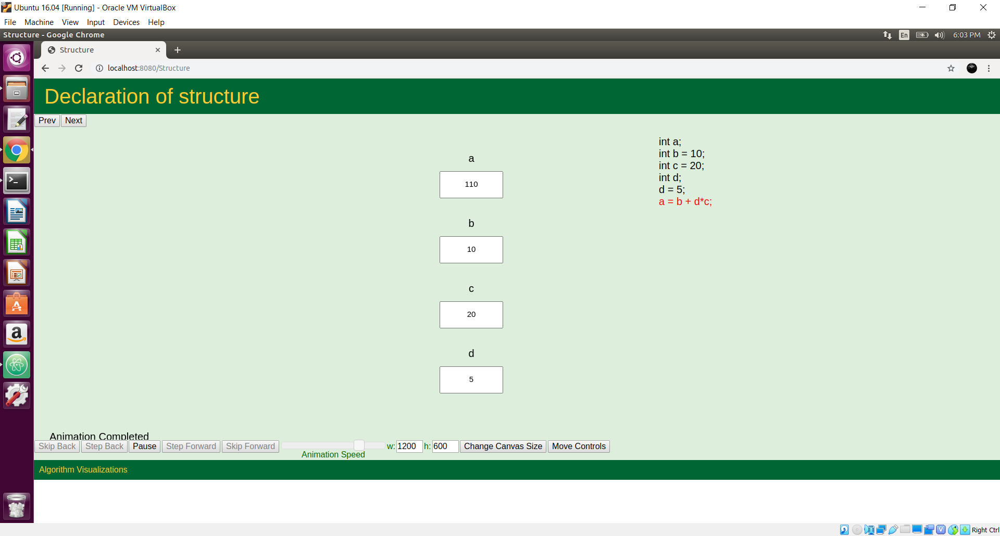
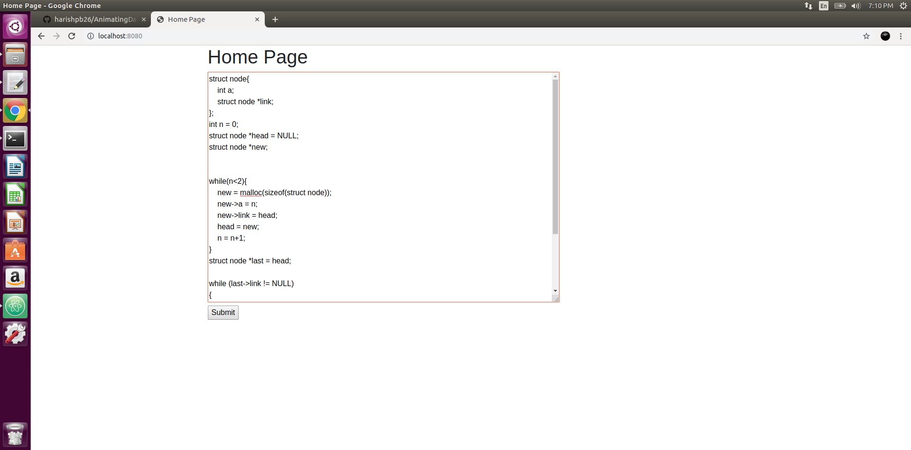
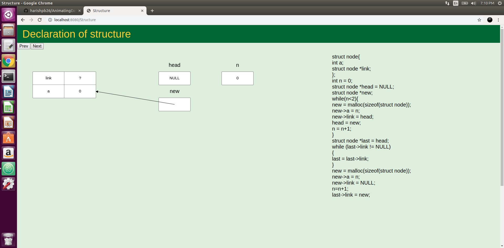
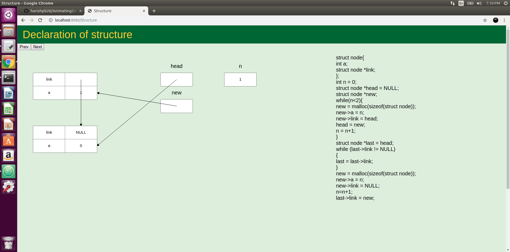
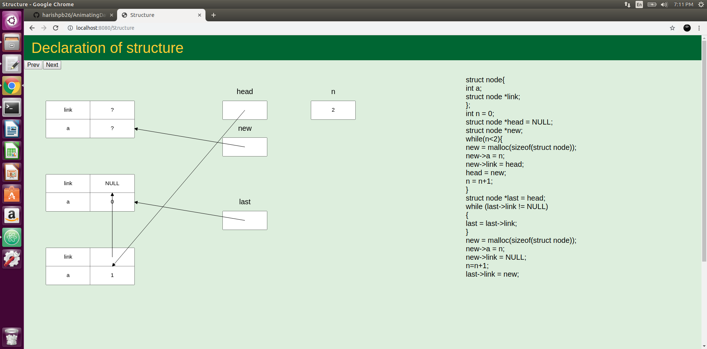
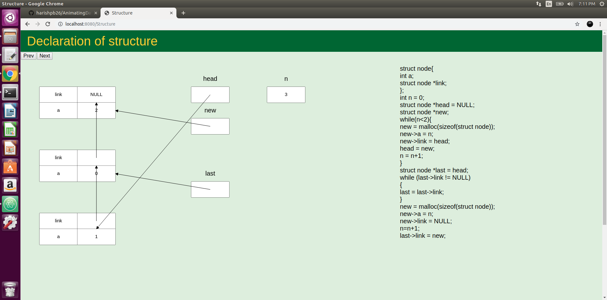

# AnimatingDataStructure

> A tool that can be used as an effective supplement to the traditional classroom education, in which students can learn through experimentation

# Introduction

> The best way to understand complex data structures is to see them in action.

# How to Use

 1. Download the repository
 2. Run _$python3 app.py_
 3. Open localhost and submit in the code in the textbox
 4. Visualize the code in action
 
# Screenshots

# References

http://www.dabeaz.com/ply

https://github.com/dabeaz/ply
