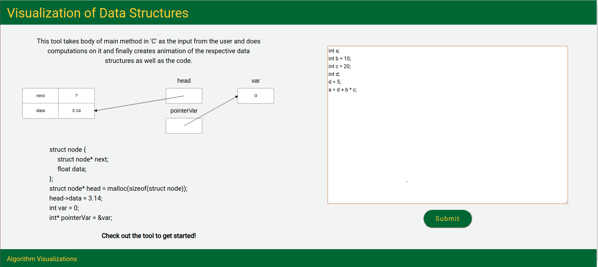
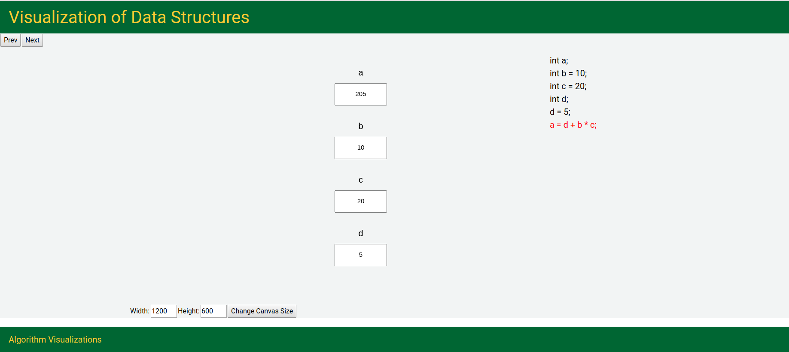
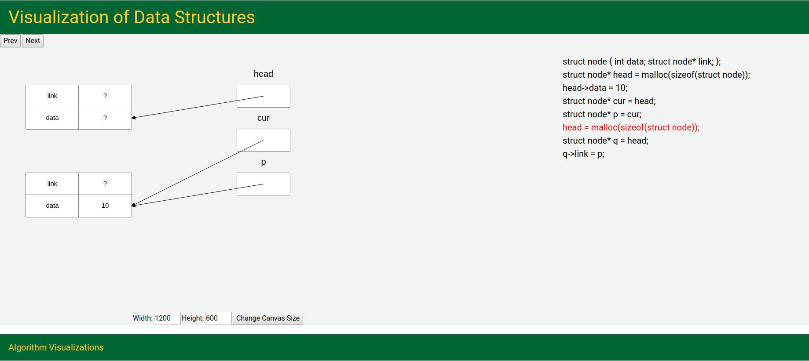
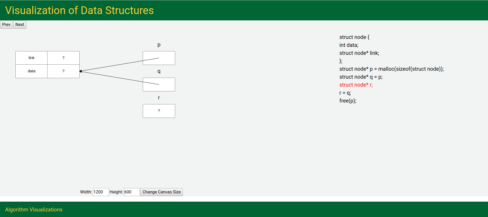
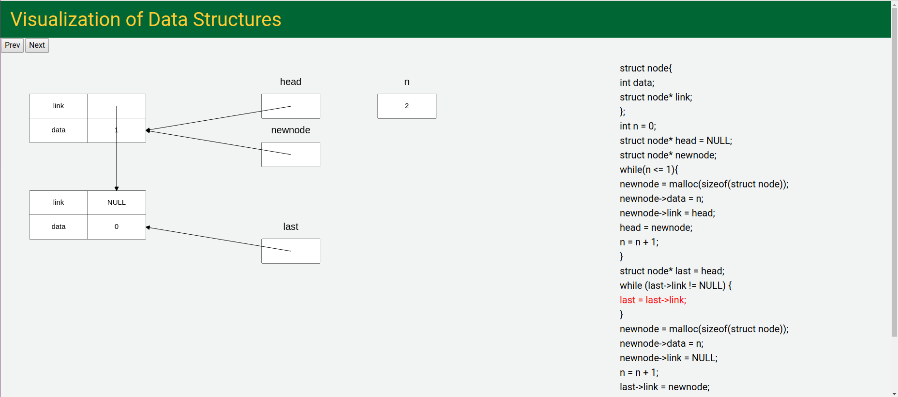
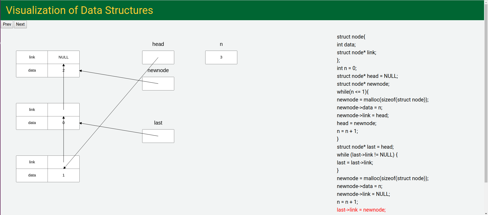

# Visualization-of-Data-Structures
A tool that can be used as an effective supplement to the traditional classroom education, in which students can learn through experimentation. 

# Introduction

The best way to understand data structures in to see them in action. Commonly, data structures are learned by implementing them in 'C'. Pointers in 'C' create another hurdle in learning. This tool takes body of main method in 'C' as the input, does computations on it and finally creates animation of respective data structures.

# Publication
This paper has been published in ICIDCA 2020 and can be accessed here https://doi.org/10.1007/978-981-15-9651-3_43

# How to Use
To clone and run this program, you'll need Git, Python3 and Flask installed on your machine. From your command line :

1. Clone this repository
  ```sh
  $ git clone https://github.com/harishpb26/Visualization-of-Data-Structures
  ```
2. Go into the repository
  ```bash
  $ cd Visualization-of-Data-Structures
  ```
3. Run the app
  ```bash
  $ python3 app.py
  ```
4. Access the tool on http://localhost:8080/
5. Enter your code in the textbox then click Submit
6. Visualize your code in action
 
# Screenshots

## Example-1



## Example-2


## Example-3


## Example-4



# References

http://www.dabeaz.com/ply
https://github.com/dabeaz/ply
